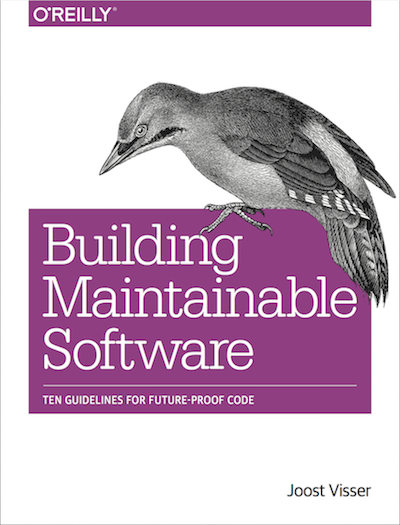

---?image=assets/bch-bg.png

### Introducing
## Start Up Pack
#### by Software Improvement Group

---

## The Start up challenge

building software that is 

- *scalable* to facilitate growth
- easy to *change* to fit to market needs 
- demonstating the quality to an investor

investor-ready.

+++

Nobody wants an investment hindered by unforeseen technical conditions. 

---
<!-- 
.reveal section img {
  border: 0;
  box-shadow: none;
} 
-->  

## The offering

- 6 months of free access to Better Code Hub for team
- Code Coaching workshops at incubator
- Free Copy of Building Maintainable Software

+++

Better Code Hub is a automated tool that provides a clear score.

+++

Better Code Hub helps to write better code. 

+++

Better Code Hub gives you a definition of done ✅

+++

Better Code Hub integrates developer feedback in GitHub

+++

Analysis is based on Building Maintainable Software

[Based on ISO 25010 standard for Software Quality](https://shop.oreilly.com/product/0636920049159.do)

+++

### Why Better Code Hub

- Provides a Definition of Done for Code Quality 
- Zero-setup time; first results within a couple of minutes
- Feedback on every Push and every Pull Request
- Supports 16 modern programming languages
- Prioritized list of refactoring candidates
- Real-time impact estimates
- Metric thresholds derived from industry benchmark data

---

## How to qualify

- Technology or internet company
- Less than 18 months old
- Fewer than 10 employees
- Less than $1.5M in funding

+++

## Other Community Offerings

- [EduPack: Code Clinics](https://education.github.community/t/a-proposed-add-on-for-code-quality-in-software-engineering-courses-using-github/9067) 
- [Open Source Spring Cleaning](https://opensourcespringcleaning.github.io/)
- [Support for Hackathons](https://dev.to/jstvssr/how-a-hackathon-appreciates-quality-code)

---

## How to Stay in Touch

- <bettercodehub@sig.eu>
- Twitter: [@bettercodehub](https://twitter.com/bettercodehub)
- Medium: [medium.com/bettercode](https://medium.com/bettercode)
- Newsletter: [Better Code Update](http://us14.campaign-archive1.com/home/?u=104bf91e618a0b2a854bdea20&id=97fcbfb998)

This presentation: <https://gitpitch.com/bettercodehub/pitch>  
✨ Thanks for your time! ✨
